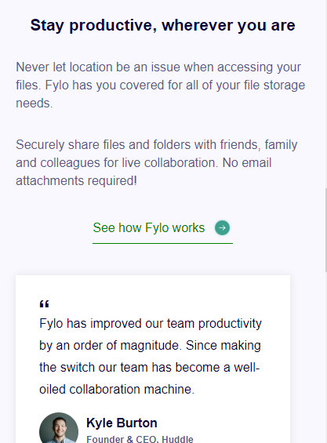
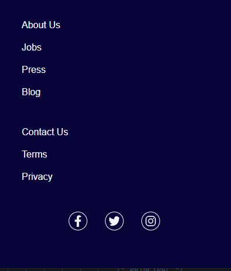

# Frontend Mentor - Fylo landing page with two column layout solution

### Screenshot

### Links

- Solution URL: [Add solution URL here](https://github.com/Wellissonb/fylo-landing-page)
- Live Site URL: [Add live site URL here](https://wellissonb.github.io/fylo-landing-page/)

## My process

### Built with

- Semantic HTML5 markup
- CSS custom properties
- Flexbox
- Mobile-first workflow

